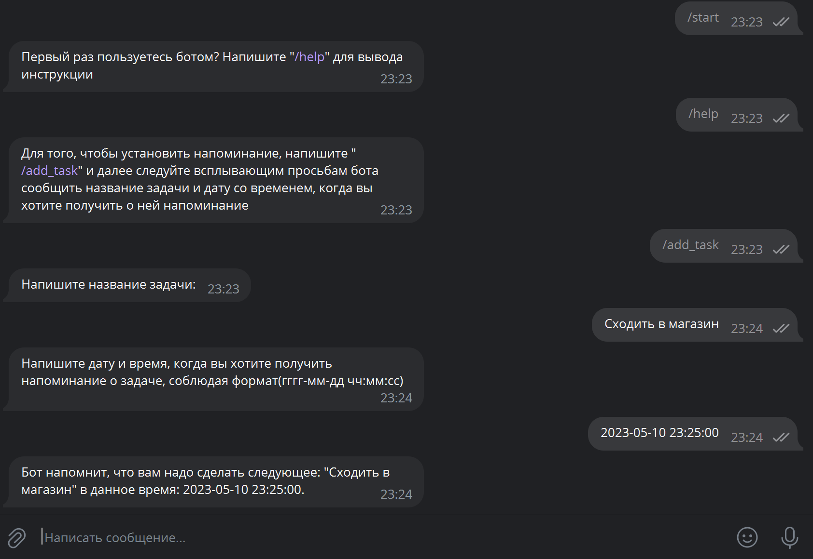
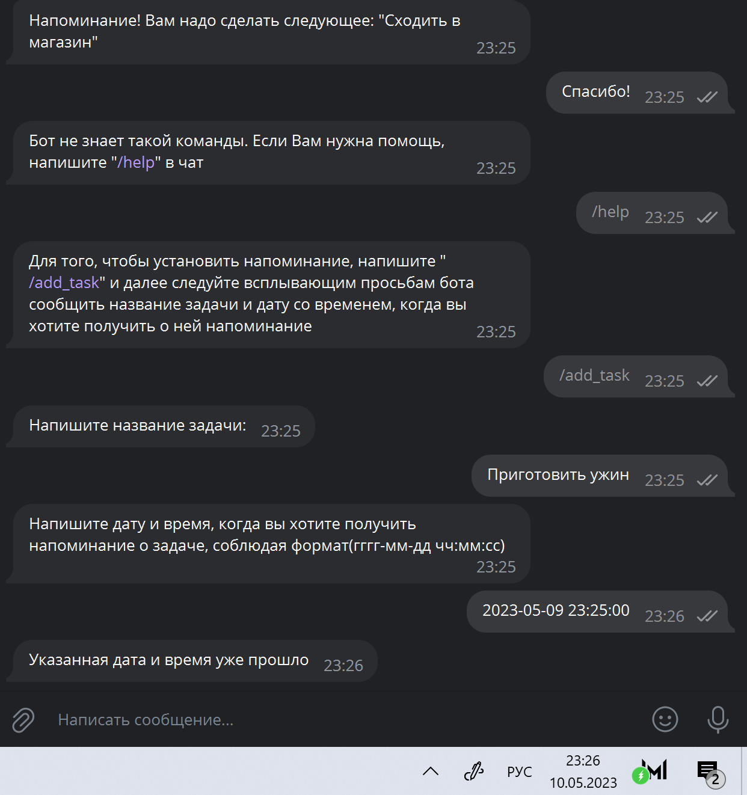

# Телеграм бот - планер

## Что делает данный бот?
 Данный бот (@ntlkay_bot) умеет ставить и выводить напоминания о записанных ему задачах

## Функциональность:
 Если человек пользуется ботом впервые, ему следует ввести команду "/start" в личные сообщения боту (@ntlkay_bot), и бот подскажет, как с ним работать дальше, а именно - выведет сообщение "Первый раз пользуетесь ботом? Напишите "/help" для вывода инструкции", что следует делать любому пользователю в случае если он забыл, как работает бот.

 Команда "/help" выводит инструкцию. Конкретно - сообщает пользователю, что ему необходимо написать "add_task" для того, чтобы добавить напоминание. Далее бот поэтапно спрашивает у пользователя сначала название задачи, которую он хочет поставить на напоминание, и время, когда бот должен отправить сообщение-напоминание ему в телеграм. Он сообщает о том, что напоминание было установлено.
 
 В установленное время бот отправит пользователю сообщение "Напоминание! Вам надо сделать следующее: (название задачи)".
 
 


Кроме того, бот умеет обрабатывать ошибки, если пользователь ввёл дату и/или время, которые уже прошли, а также умеет рекомендовать использовать команду "/help" в случае, если пользователь не ввёл сообщение, подходящее по формату:


 
## Инструкция по запуску бота на локальной машине:
```
git clone git@github.com:ntlkay/Telegram-bot.git
cd Telegram-bot
pip install -r requirements.txt
python3 main.py
```
Если на шаге клонирования репозитория потребуется пароль, - введите "1" (без кавычек)
